# vertical-align

>The vertical-align CSS property specifies the vertical alignment of an inline or table-cell box. ———MDN

`vertical-align`只对**inline级元素**起作用。一般`display`值为如下值：

- inline
- inline-block
- inline-table(本文不讨论)

**inline元素**：一般是包裹文本的标签，有padding、border、margin属性

**inline-block元素**：与**inline元素**的区别是它有width、height属性

### Baseline和外边缘（outer edges）

`vertical-align`只对**inline级元素**起作用，而**inline级元素**的baseline和外边缘是其垂直对齐的参考点。首先来看看**inline级元素**的baseline和外边缘：

#### inline元素的baseline和外边缘

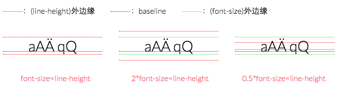

- 外边缘：inline元素的外边缘与其line-height的top和bottom边缘对齐

- baseline：inline元素的baseline位于低于字体高中点的某处（[参考](http://www.w3.org/TR/CSS2/visudet.html#leading)）

#### inline-block元素的baseline和外边缘

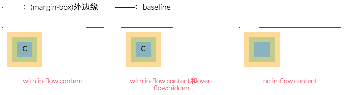

- 外边缘：inline-block元素的外边缘与其[margin-box](https://www.w3.org/TR/CSS2/box.html#x17)的top和bottom边缘对齐。

- baseline：inline-block元素的baseline依赖于其是否有in-flow内容（文档流内容）：

	- 如果有in-flow内容，baseline与其中最后一个内容元素的baseline对齐，而内容元素的baseline则根据其自身规则确定
	
	- 如果有in-flow内容和`overflow`属性，且`overflow`的值为除`visible`外的值。则baseline与其margin-box的bottom边缘对齐
	
	- 如果没有in-flow内容，则baseline与其margin-box的bottom边缘对齐

#### line-box

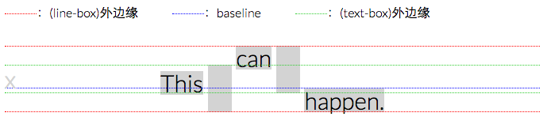

- 外边缘：line-box的外边缘与其内的最低和最高的元素的外边缘对齐

- baseline: line-box的baseline是不定的，即可变的
	
	>CSS 2.1 does not define the position of the line box's baseline. — [the W3C Specs](http://www.w3.org/TR/CSS2/visudet.html#line-height)
	
    - 当其与`vertical-align`合作时，baseline的位置需要同时满足垂直对齐和line-box的最小高度的条件。
    
    - line-box的baseline是不可见的，如想要知道其的baseline在哪里，可以通过添加字符，前提不要对其使用任何对齐方式，这样它的baseline就是字符的baseline。
    
    - text-box与baseline是关联的，当baseline改变时，text-box也会随之改变。其中text-box只包含line-box中没有格式化的文本。

### vertical-align

- 相对于line-box的baseline对齐元素的baseline

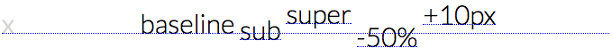
	
	- baseline：元素的baseline与line-box的baseline对齐
	
	- sub：元素的baseline低于line-box的baseline
	
	- super：元素的baseline高于line-box的baseline
	
	- x%：元素的baseline相对于line-box的baseline偏移line-height*x%
	
	- xpx：元素的baseline相对于line-box的baseline偏移xpx

- 相对于line-box的baseline对齐元素的外边缘

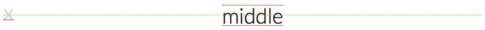

	- middle: 元素的top和bottom外边缘的中心点对齐line-box的baseline+`x-height`的一半高度

- 相对于line-box的text-box对齐元素的外边缘
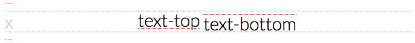

因为line-box的text-box与其的baseline是相互关联的，所以实际也是相对于line-box的basline。
	
	- text-top：元素的top边缘对齐line-box的text-top的top边缘
	
	- text-bottom：元素的bottom边缘对齐line-box的text-top的bottom边缘

- 相对于line-box的外边缘对齐元素的外边缘

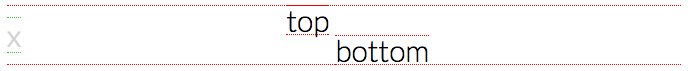

	- top：元素的top边缘对齐line-box的top边缘
	
	- bottom：元素的bottom边缘对齐line-box的bottom边缘

#### 解决`vertical-align`没有工作的方法：

- 确定line-box的basline和外边缘
- 确定inline级元素的baseline和外边缘

### 案例分析

#### 1.使用了`vertical-align:middle`，但icon是没有居中对齐？

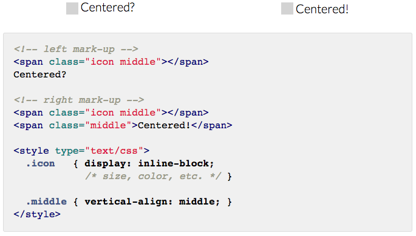

如图上图所示：左边case是没有居中对齐，而右边case是居中对齐的。当然针对该案的解决有多种，右边case只是其中一种。我们增加一些辅助线来确定line-box及inline级元素的baseline和外边缘：
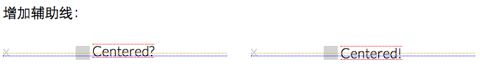

如上图所示：icon之所以没有对齐，因为对其使用了`vertical-align`，让其中点对齐line-box的baseline+`x-height`的一半高度，而右边的文本没有使用任何对齐方式，默认处于line-box的baseline上。如果想让icon和文本对齐，这里给出三种解决方法：

- 不改变line-box的baseline。即使用`vertical-align:top|bottom`，这样会相对于line-box的外边缘对齐元素的外边缘

- 改变line-box的baseline，让其满足对齐要求。将icon的`vertical-align: x%|xpx`即可

- 将右边的文本用标签包裹起来，将其的`vertical-align:middle`。即上图右边case给出的方法

#### 2.怎么inline级元素下方会有一段空隙？

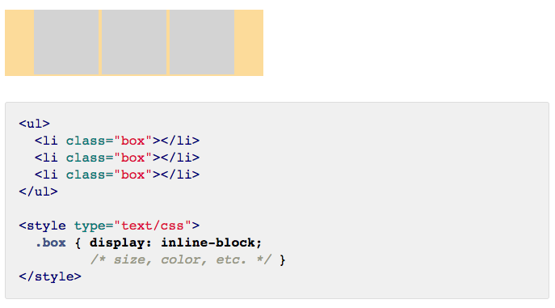

如上图所示：三个列表项的下方多出一段空隙。如上一案例同样的解决方法：增加一些辅助线来确定line-box及inline级元素的baseline和外边缘：

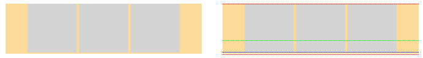

如上图所示：之所以多出一段空隙，因为我们没有对列表项使用任何对齐方式，默认`vertical-align:baseline`。而浏览器为了让文本能完整展示，需要在baseline的下方预留一定的空间（强制），所以就导致空隙的出现。知道了原因，对症下药，只要给baseline下方留出足够的空间，就可以避免该问题。解决方法：

- 不改变line-box的baseline。即使用`vertical-align:top|bottom`，这样会相对于line-box的外边缘对齐元素的外边缘

- 改变line-box的baseline，让其预留出足够的空间。如`vertical-align:middle|x%|xpx|super`等

- 将`display:inline|inline-block`修改为`display:block`

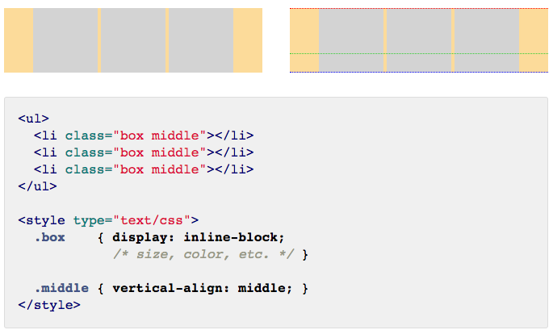

### 参考文章
- [Vertical-Align: All You Need To Know](http://christopheraue.net/2014/03/05/vertical-align/)

